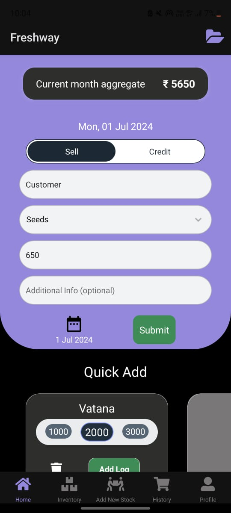

# Freshway

Cross paltform application to manage store inventory of our family shop, **_Freshway krushi seva kendra, Diskal_**.

### Screenshots (android)

|   |  |  |
| :-------------------------------: | :------------------------------: | :------------------------------: |
|  |     |  |

## Features

**Application**

- Dark/Light mode
- Cloud storage
- User Authentication

**Services**

- Quick Add frequent expenses
- Track expenses and incomes easily
- Track inventory (seeds, pesticides, fungicides)

## Database modelling

The first step in optimizing performance is to understand expected and actual query patterns.

Few principles I try to abide while structuring my noSQL databases:

- Big collection and small documents for efficient queries
- Embed related objects in documents when possible.
  - This will avoid the performance overhead of repeated requests for data stored in separate collections, which can be much slower than embedded fields.
- Atomic operations for data consistensy and integrity
- Having aggegration document for tracking complex and read-intensive operations
- minimise document reads by using memo

## EAS build

EAS Build is a hosted service for building app binaries for your Expo and React Native projects.

eas.json

```json
{
  "build": {
    "preview": {
      "android": {
        "buildType": "apk"
      }
    },
    "preview2": {
      "android": {
        "gradleCommand": ":app:assembleRelease"
      }
    },
    "preview3": {
      "developmentClient": true
    },
    "preview4": {
      "distribution": "internal"
    },
    "production": {}
  }
}
```

## Build bundles

Android

```
eas build -p android --profile preview
```

Use expo on android or ios to preview the application without the need for installing an imulator on the working machine

## Firebase config

Setup the firebase config at _src/firebase.keys.ts_

Things to include in config.js:

```javascript

const firebaseKey = {
  // apiKey
  // authDomain
  // projectId
  // storageBucket
  // messagingSenderId
  // appId
  // measurementId
}

const expoProjectId = {"YOUR_ID"} // from expo.dev

export { defaultAvatar, firebaseKey, expoProjectId }
```
